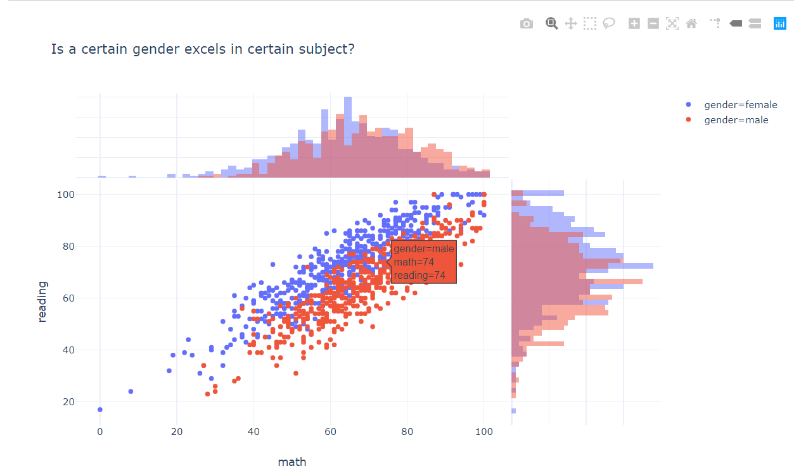

# EDA-Plotly-Express
Explanatory data Analysis with plotly Express 

### Background

One morning, you a data analyst get new dataset, and at afternoon you need present some insight from the data to your supervisor, unfortunately sometimes this happens. The best way to present some insight of course with visualisation, gladly there is this visualisasion library called plotly-express that can help you with that. Plotly Express is a terse, consistent, high-level API for rapid data exploration and figure generation. It's suppose help you to visualize your data quick and easy. So I creating this course book to give some demo on how to use this library to explore your data and answer some of your bussiness question quickly.

### The data

The dataset we use consists of the marks secured by the students in various subjects, which accessible from Kaggle Student Performance in Exams.

The Inspiration is to understand the influence of the parents background, test preparation etc on students performance. It comprises of 1,000 rows and 8 columns:

- gender
- race / ethnicity
- parental level of education - Bachelor's degree, master's degree, or some college
- lunch - standard or free/reduced
- test preparation course - none or completed
- math score
- reading score
- writing score

### Libraries

<<<<<<< HEAD
The libraries we use today is pandas and plotly.express. You can install it by `pip install plotly`
=======
The libraries we use today is pandas and plotly_express. You can install it by `pip install plotly-express`
>>>>>>> 335e96dc2b0011e3120e1d99b8ff6e7f74c305bb
